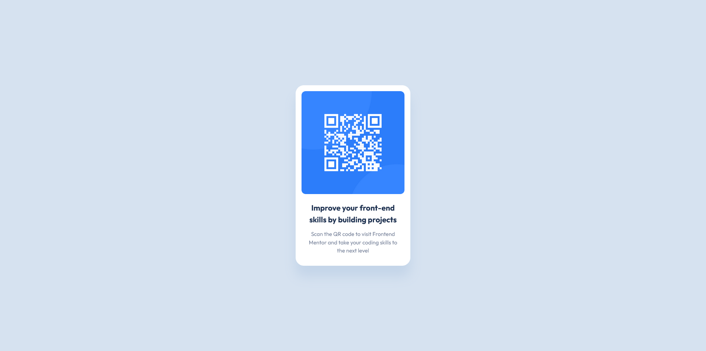

# Frontend Mentor - QR code component solution

This is a solution to the [QR code component challenge on Frontend Mentor](https://www.frontendmentor.io/challenges/qr-code-component-iux_sIO_H). Frontend Mentor challenges help you improve your coding skills by building realistic projects. 

## Table of contents

- [Overview](#overview)
  - [Screenshot](#screenshot)
  - [Links](#links)
- [My process](#my-process)
  - [Built with](#built-with)
  - [What I learned](#what-i-learned)
- [Author](#author)

## Overview

### Screenshot

### Links

- Solution URL: [Github](https://github.com/MikeBeloborodov/QR_code_component)
- Live Site URL: [Netlify](https://neon-belekoy-0198d5.netlify.app/)

## My process

### Built with

- Semantic HTML5 markup
- CSS custom properties
- Flexbox
- CSS Grid
- Mobile-first workflow

### What I learned

Didn't notice box-shadow on card at first, but then added it later. Starting to notice small details.

## Author

- Github - [Mike Beloborodov](https://github.com/MikeBeloborodov)
- Frontend Mentor - [@MikeBeloborodov](https://www.frontendmentor.io/profile/MikeBeloborodov)